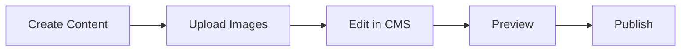

<div align="center">

# Kronos Novels

**Perjalanan Cerita Tanpa Batas Waktu**

[](https://pages.cloudflare.com/)
[](https://vitepress.dev/)
[](https://vuejs.org/)

Platform baca novel modern yang dibangun dengan teknologi terdepan untuk pengalaman membaca yang optimal.

[**Demo Live**](https://kronos-novels-gk.pages.dev/) • [**Dokumentasi**](https://kronos-novels-gk.pages.dev/docs) • [**Kontribusi**](CONTRIBUTING.md)

</div>

---

## ✨ Fitur Utama

<table>
<tr>
<td width="50%">

### 📚 Manajemen Konten
- **Static Site Generation** dengan VitePress
- **Git-based CMS** dengan Decap untuk editing mudah
- **Media storage** terintegrasi dengan UploadThing
- **Markdown support** untuk penulisan yang fleksibel

</td>
<td width="50%">

### 🎨 Pengalaman Pengguna
- **Bookmark otomatis** dengan IndexedDB
- **Dark mode support** untuk kenyamanan mata
- **Responsif** di semua perangkat
- **Performance tinggi** dengan caching optimal

</td>
</tr>
</table>

## 🚀 Quick Start

### Prerequisites
- Node.js 18+ 
- npm atau yarn
- Git

### Installation

```bash
# Clone repository
git clone https://github.com/muhammad-zainal-muttaqin/kronos-novels-gk.git
cd kronos-novels-gk

# Install dependencies
npm install

# Start development server
npm run dev
```

### Available Scripts

| Command | Description |
|---------|-------------|
| `npm run dev` | Start development server |
| `npm run build` | Build for production |
| `npm run preview` | Preview production build |

## 🌐 Deployment

### Cloudflare Pages Setup

1. **Connect Repository**
   - Login ke [Cloudflare Pages](https://pages.cloudflare.com/)
   - Connect ke GitHub repository ini

2. **Build Configuration**
   ```
   Build command: npm run build
   Output directory: docs/.vitepress/dist
   ```

3. **Environment Variables**
   | Variable | Description | Required |
   |----------|-------------|----------|
   | `GITHUB_CLIENT_ID` | GitHub OAuth App Client ID | ✅ |
   | `GITHUB_CLIENT_SECRET` | GitHub OAuth App Client Secret | ✅ |
   | `UPLOADTHING_TOKEN` | UploadThing API token | ✅ |

### Manual Deployment
```bash
npm run build
# Upload docs/.vitepress/dist ke hosting provider
```

## 📖 Cara Penggunaan

### Admin Panel
Akses panel admin Decap CMS di `/admin` untuk mengelola novel dan chapter.

**Langkah-langkah:**
1. Buka `/admin` di browser
2. Login dengan akun GitHub
3. Mulai membuat novel atau chapter baru

### Image Uploader
Upload gambar cover dan ilustrasi chapter melalui `/uploader`.

**Workflow:**
1. Akses `/uploader`
2. Upload gambar ke UploadThing
3. Copy URL gambar yang dihasilkan
4. Paste URL di CMS untuk digunakan

### Content Management


## 🛠️ Tech Stack

<div align="center">

### Frontend


### Backend & Services


### Database & Storage


</div>

| Teknologi | Fungsi | Alasan Dipilih |
|-----------|--------|----------------|
| **VitePress** | Static Site Generator | Performance tinggi, SEO-friendly |
| **Vue 3** | Frontend Framework | Reaktif, mudah dipelajari |
| **Decap CMS** | Content Management | Git-based, tidak perlu database |
| **UploadThing** | Media Storage | Upload mudah, CDN terintegrasi |
| **IndexedDB** | Local Storage | Bookmark offline, fast access |
| **Cloudflare Pages** | Hosting | Global CDN, auto-deploy |
| **Cloudflare Workers** | Serverless Functions | OAuth handling, API endpoints |

## 🤝 Contributing

Kami menyambut kontribusi dari komunitas! Silakan baca [CONTRIBUTING.md](CONTRIBUTING.md) untuk panduan lengkap.

### Quick Contribute
1. Fork repository ini
2. Buat branch fitur (`git checkout -b feature/AmazingFeature`)
3. Commit perubahan (`git commit -m 'Add some AmazingFeature'`)
4. Push ke branch (`git push origin feature/AmazingFeature`)
5. Buat Pull Request

## 📄 License

© 2025 Kronos Novels. All rights reserved.

---

<div align="center">

**Dibuat dengan ❤️ untuk komunitas pembaca Indonesia**

[](https://github.com/muhammad-zainal-muttaqin/kronos-novels-gk/stargazers)
[](https://github.com/muhammad-zainal-muttaqin/kronos-novels-gk/network/members)

</div>
